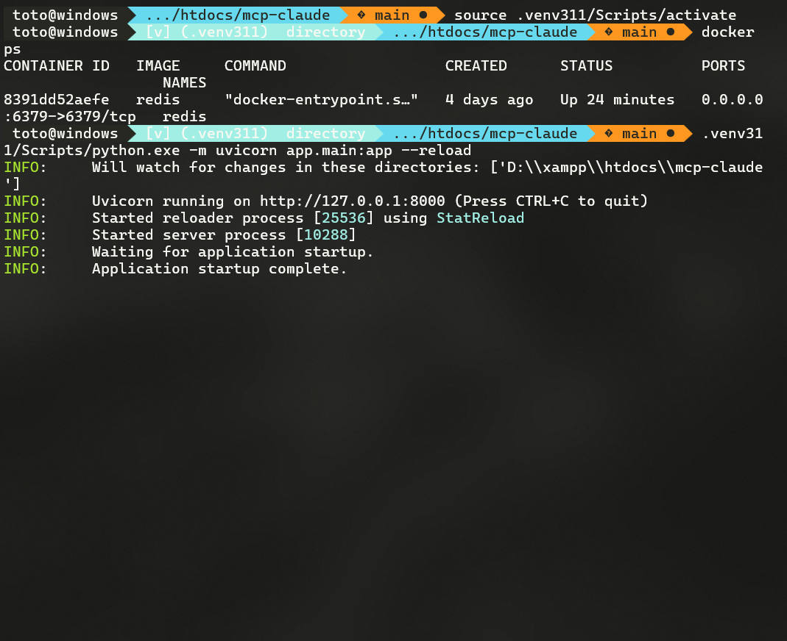

# MCP Claude Desktop


[](https://opensource.org/licenses/MIT)

> 🤖 MCP (Model Context Protocol) es un servidor personalizado que potencia la integración de Claude AI en aplicaciones de escritorio. Diseñado para desarrolladores que necesitan una interfaz robusta y eficiente para interactuar con modelos de lenguaje de Anthropic, ofrece caché distribuido, procesamiento asíncrono y una API REST completa. Con soporte para plugins, logging avanzado y métricas en tiempo real.

## Acerca del proyecto

Aplicación de escritorio que integra la API de Claude de Anthropic, proporcionando una interfaz local para interactuar con el modelo de lenguaje. Incluye funcionalidades de caché, procesamiento asíncrono y una API REST para integración con otras aplicaciones.

## Tecnologías principales
- Python 3.11+
- FastAPI para la API REST
- Redis para caché y almacenamiento
- Docker para contenedorización
- Claude API de Anthropic
- Pytest para testing

## Características
- Interfaz de escritorio para Claude
- API REST local para integración
- Sistema de caché con Redis
- Procesamiento asíncrono
- Manejo de archivos y formularios
- Sistema de logging robusto
- Métricas con Prometheus
- Testing automatizado

## Estructura del proyecto
```bash
├── app/              # Código principal de la aplicación
├── src/              # Código fuente adicional
├── tests/            # Tests automatizados
├── docs/             # Documentación
├── plugins/          # Plugins y extensiones
├── uploads/          # Directorio para archivos subidos
├── logs/             # Logs de la aplicación
└── temp/             # Archivos temporales
```

## Requisitos
- Python 3.11+
- Redis
- Docker (opcional)
- API Key de Anthropic

## Instalación
1. Clona el repositorio
2. Crea un entorno virtual: `python -m venv .venv`
3. Activa el entorno: `.venv\Scripts\activate` (Windows)
4. Instala dependencias: `pip install -r requirements.txt`
5. Configura las variables de entorno (ver .env.example)

## Uso
1. Inicia Redis
2. Ejecuta la aplicación: `python run.py`
3. Accede a la interfaz web en `http://localhost:8000`

## Desarrollo
```bash
# Instalar dependencias de desarrollo
pip install -r requirements.txt

# Ejecutar tests
pytest

# Formatear código
black .
isort .
```

## Contribuciones
Las contribuciones son bienvenidas. Por favor:
1. Haz un fork del proyecto
2. Crea tu rama (`git checkout -b feature/nueva-funcionalidad`)
3. Commitea tus cambios (`git commit -m 'Agrega una funcionalidad'`)
4. Haz push a la rama (`git push origin feature/nueva-funcionalidad`)
5. Abre un Pull Request

## Licencia
Este proyecto está bajo la Licencia MIT. Consulta el archivo [LICENSE](./LICENSE) para más detalles.
